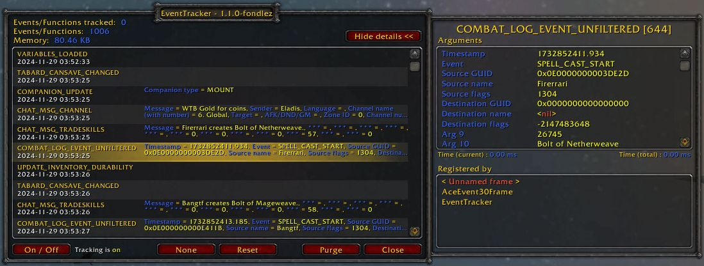

# EventTracker

Event Tracker is an addon for World of Warcraft that allows you to view detailed 
information on tracked events.

Tested clients: 2.4.3 (The Burning Crusade), 3.3.5 (Wrath of the Lich King).

This version is a backport from redeye's Event Tracker 1.4 (January 18, 2010) 
with fixes and improvements.

## Graphical Interface

## Slash Commands

**/et** - open/close EventTracker dialog

**/et { help | ? }** - Show this list of commands

**/et add <event>** - Add event to be tracked

**/et { remove | del } <event>** - Remove event to be tracked

**/et clear** - Remove all added tracked events

**/et list** - List the added tracked events

**/et off** - Turn off tracking

**/et on** - Turn on tracking

**/et toggle** - Toggle tracking on or off

**/et filter** - Filter for events (plain substring). Requires `registerall` to 
be active

**/et { removefilter | delfilter }** - Remove filter

**/et purge** - Purge all event data

**/et reset** - Unregister all events, then register only tracked events

**/et { registerall | all }** - Register all events to be tracked (# of events 
not known)

**/et { unregisterall | none }** - Unregister all events to be tracked (except 
for VARIABLES_LOADED)

**/et resetpos** - Reset position of the main EventTracker frame

## Feature Notes

### State of Tracking
###### *"Stop It Scrolling!"*

Disabling and enabling whether events are being tracked can be done by clicking
the On/Off button at the bottom of the main window or by using the `/et off`,
`/et on` and `/et toggle` slash commands. Tracking is re-enabled by login or
reload.

### Shift Click Events in the Main Window
###### *"Get Out!"*

- shift-clicking any event in the list of events of the main window will 
unregister the event and purge all data for that event.

### Add Events from Slash Commands
###### *"This Is My Event. There Are Many Like It ..."*

- events added with `/et add`, removed with `/et remove` and `/et clear`, and 
shown with `/et list` are saved across login sessions. 
- these events are affected by `/et filter` after `registerall` is active. 
- using `/et reset` will reset to only these tracked events and those from 
`EventTracker_events.lua`.

### Filter All Registered Events
###### *"You Got Something That Sounds Like ...?"*

- any string added with `/et filter` will be used to do a plain substring search 
of event names after `registerall` is active. Only matching events and those 
from `EventTracker_events.lua` will apply. 
- if no string is given, the current filter is displayed.
- using `/et removefilter` will remove the filter.

### Lua Lists
###### *"Take It, Take It All!"*

The addon file `EventTracker_events.lua` can be edited to directly add two 
event lists. This is useful for bulk or permanent changes.

- `ET_TRACKED_EVENTS`: add to this array of events to permanently track events
- `ET_IGNORED_EVENTS`: add to this array of events to permanently ignore events 
after `registerall` is enabled. 

These event lists are unaffected by the `/et filter` slash command. The lists 
will always apply, except if `/et unregisterall` is used.

### Ways to Reset Events
###### *"Hit The Reset Button! ... Wait, Which One?"*

- using `/et purge`, or the main window Purge button, will clear shown event 
data; it does not affect registered events. 
- using `/et reset` will unregister all events, then re-register all tracked 
events from `EventTracker_events.lua` and additional tracked events from the 
slash commands. It will purge existing event data.
- using `/et unregisterall` will unregister all events except 
`VARIABLES_LOADED`. It will purge existing event data.

## Credits

The original author of EventTracker is redeye <wowaddon@xs4all.nl>, with an
initial public release in June 8, 2009. Downloaded from 
https://www.curseforge.com/wow/addons/eventtracker

To raise any issues with this release, please use the Issues section of the
repository at http://github.com/fondlez/EventTracker
